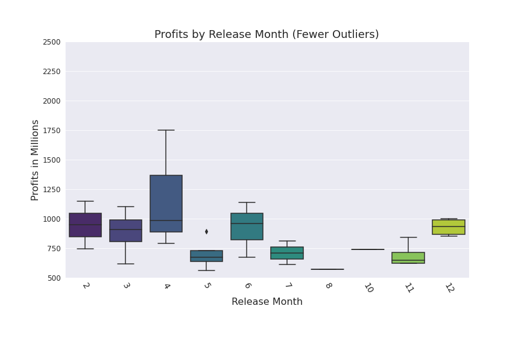
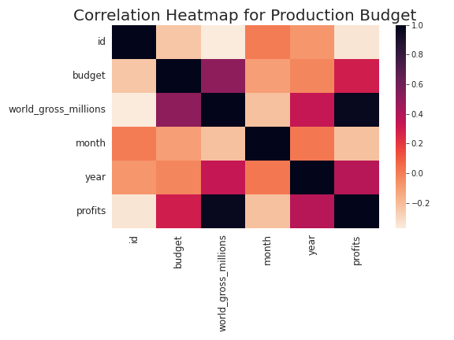

# Movie Production Analysis for Microsoft

**Author**: [Fred Mutuma](mailto:fred.mutuma@school.moringaschool.com)

## Overview

I have been tasked with assisting Microsoft in their venture into the movie industry. My goal was exploring what types of films are currently doing the best at the box office and to provide these findings to Microsoft's new movie studio executives. My analysis of the movie industry, achieved by garnering data and utilizing descriptive statistics and visualizations, has shown that a larger budget is correlated with a higher worldwide box office gross. By allocating 100 million to 250 million dollars to produce a movie released in June or November, or December the analysed data shows that a movie studio will be extremely likely to succeed. I have also given recommendations as to which studios to benchmark from and learn a thing or two from them. Most importantly their production process. Microsoft can use this report to target their production budget, genre, release-time, and other great studios for collaboration in their upcoming movie endeavors to generate the highest amount of revenue possible.

## Business Problem

I have been informed that Microsoft want to dip their toes in the movie-making industry, and have tasked me with providing an analysis to be used for this business. They need the necessary knowledge to move forward. To assist them with this goal, I have been looking at the movies that grossed highest in worldwide box office amounts for the years between 2016 to 2019. By analyzing the movies that have been most successful recently, I amto make recommendations about attributes that Microsoft's movies should have in order to achieve the highest revenue. I have based my analysis on four main factors:

* Movie Genre: What types of movie content are currently most successful?
* Time of Release: When is the most profitable time of year to release a movie?
* Production Budget: What budget amount tends to achieve the highest box office gross?
* Additional Recommendations: What else do top-grossing movies have in common from the analysed data?

## Data
I utilized four different data sources for my analysis. In order to have the most comprehensive view of the industry as it currently is, I limited all my data to the years 2016 to 2019.

imdb.title.basics.csv.gz: this is a dataset from imdb site with basic information of top movies with ther runtimes, genre and year of release.
title.ratings.csv: This dataset contains ratings from the movies mentioned in the basics dataset above.
tn.movie_budgets.csv: This dataset contains the production budgets for top grossing movies of all time. I used it to compare and analyse budget needed to produce a top grossing box office movie.
bom.movie_gross.csv: This dataset contains domestic and worldwide gross of movies from 2010 onwards to 2019. I oly used the data of movies from 2016 to 2019 to ensure I used the most recent data.

They are all contained in the data folder of this project

## Methods

I utilized descriptive statistics as well as
visualizations to illuminate trends in the data and isolate key factors for making a successful movie.

## Results

My analysis and findings have shown that the more a studio invests in the production of a movies the higher the gross revenue they acquire easily getting bigger profits. Though there are some outliers, the majority of high-grossing movies for these particular types of movies are ones with higher budgets. For Adventure, Drama or an Animated movie, the budget is best at between 55 and 200 million dollars. For a Action or Fiction movie, that amount is between 150 and 350 million dollars. From my analysis, the best months to release a movie depends on the statistics collected on profits acquired. April came top followed by June and December. Moreover, I noted that the Action and Fiction movies were released mostly on April and June making them the top priority when considering release dates of these movies.

## Conclusions

While the past ten years of data show that this should be a good recipe for success, one limitation is the absence of recent data; this means 2020 and 2021 data. This may be because of the current world events(the COVID-19 pandemic and the war in europe).

### Next Steps

In the future analysis it would be better to also do an analysis of streaming services and get more insights. This project can be as wide as one wants it to be but the objectives I set earlier have helped me come up with a short, thorough and insigtful analysis and visualisation.

The application of statstical methods and visualsations has made this project do-able. As they say; statistics don't lie.
